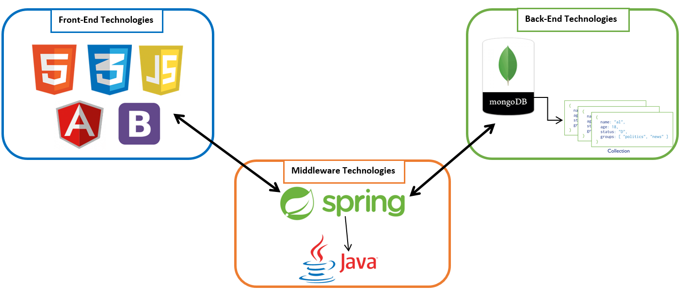

# Learn on Your Own

**Student Name:** Gary McHugh <br />
**Student ID:** G00308668 <br />
**Student Name:** Sean Mc Grath <br />
**Student ID:** G00316649 <br />
**Module:** Applied Project and Minor Dissertation<br />
**Advised By:** Gerard Harrison <br />

___

# Introduction	

### Technologies Used:

+ **Operating System:** Windows 10
+ **IDE:** Eclipse, InteliJ and Visual Studio Code
+ **Language's used:** Java, AngularJS, HTML, CSS, JavaScript
+ **Database used:** MongoDB
+ **Hosting Site:** GitHub
+ **Documentation:** Project.pdf and ReadMe.md
+ **Additional:** GitHub Issues, ZenHub Boards (Kanban board)


### Deployment Details
Follow the steps below to deploy this project:

1. Download [Eclipse EE](http://www.eclipse.org/downloads/packages/eclipse-ide-java-ee-developers/neonr) or [IntelliJ](https://www.jetbrains.com/idea/download/#section=windows) for your desired operation system and run the installer.
2. Download the community edition of [MongoDB](https://www.mongodb.com/download-center#community) for your desired operation system and run the installer.
3. (Optional) Download [Mongo Chef](https://studio3t.com/download/) for your desired operation system and run the installer. This is to execute the mongo script in.
4. Open a command prompt and enter 'mongod'.
5. Download a zip file of this project and unzip it or download [Git](https://git-scm.com/downloads) and execute the following command in the Git Bash Console
	```
	https://github.com/seaniemc/LearnOnYourOwn.git
	```
6. Open Mongo Chef and execute the mongo commands as instructed below under the "Creating the database" heading.
7. If you do not have MongoChef then open a new command prompt and type 'mongo' into it. Execute the commands as instructed under the "Creating the database" heading.
8. Open this project within Eclipse EE or IntelliJ by importing the project into the IDE as a maven project.
9. Run TodoApplication.Java.  
You can alternatively run the project from the command line, by navigating to the project folder in the console and running the following command
	```
	mvn spring-boot:run
	```
10. Navigate to http://localhost:8080/ in your preferred browser.


### About this project
The purpose of this project was to create a web application containing video tutorials on various programming languages. This web application was designed to help people like students who are new to programming. We wanted to develop a platform where students who are struggling with programming can come and watch tutorials on a variety of subjects to help improve their skills. The users can also ask questions to the lecturers on the course page in a comment section.


Our system will allow Users to register and log in to the application, from there they will see a variety of courses in various programming languages such as C\#, Java and Python. The user will be able to go to that course and watch a set of tutorials on that subject. They can leave comments on the course page to ask questions to the lecturer or give their feedback.


This project involved research, learning and understanding many new frameworks such as Spring, MongoDB and AngularJS. We also had to understand the architecture of making an application with these technologies.

We wanted to use this project as an opportunity to research and apply modern technologies that are commonly used in industry. We also wanted to use these technologies in an architecture that would be substantial for a Level 8 degree while creating a robust and well-designed system. We wanted to ensure that we used newer technologies that had the stability to be applied to our project. Our goal was to use technologies that were both new and that we believed would be used for years to come. This would aid us with our employability having used these technologies.


Here is a list of the main technologies that we used:
+ MongoDB
+ Spring Boot Framework (using Java)
+ AngularJS
+ HTML5
+ CSS
+ JavaScript
+ Bootstrap

Below is a diagram of the architecture of our application:
<p align="center">
	
</p>

Here is a list of the features in the application:
+ Courses page containing a list of all the available courses in the application.
+ Individual course pages containing video tutorials, a comment section and the lecturer's details for that course.
+ Lecturer page that displays the details of all of the lecturer's.
+ Edit page for Courses, which lets you create, update and delete any courses details.
+ Edit page for Lecturer that allows you to create, update and delete any lecturer's information.
+ Sign up page which allows a user to sign up and stores the user's details in the database.
+ Login page that allows the user to sign in using their details.
+ The application also allows the user to sign in using their google account through the Google API.

### Creating the database
You must have completed step 4 of deployment details to run the database.
Open up MongoChef or the command prompt as instructed in steps 6 and 7 of deployment details.
In MongoChef, click the connect button in the top left corner, connect to localhost:27017.
Open the Intelishell.

The commands you need are located in MongoDBScript.txt in this repository.

Execute the following commands first

	
	use LearnOnYourOwn

	db.createCollection("courses")
	db.createCollection("lecturer")
	db.createCollection("users")
	db.createCollection("todos")
	
	
Once you have executed those, you can execute each of the command blocks between the headings.

Sample for users:

	
	db.users.insert([
	{
	"name":"Tim Miles",
	"username":"TMiles",
	"password":"TimM471",
	"role":"2"
	},
	{
	"name":"Logan Porter",
	"username":"Porter77",
	"password":"Fireman97",
	"role":"2"
	},
	{
	"name":"Daisy Patterson",
	"username":"Patty",
	"password":"DPattHype",
	"role":"2"
	},
	...
	
	
repeat this for each collection.
